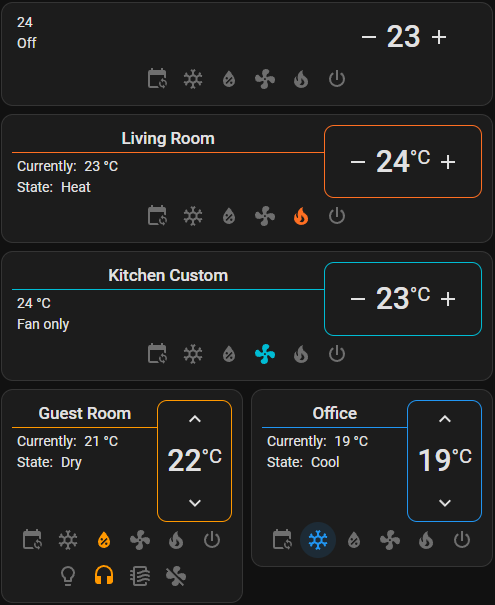
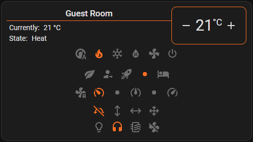
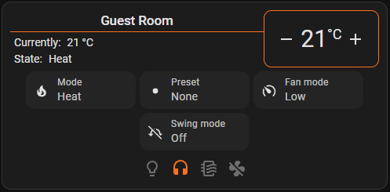
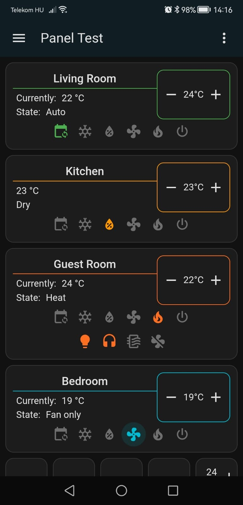
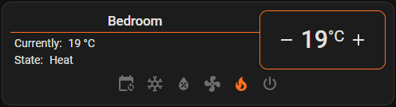
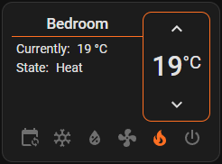

# Mini Thermostat Card

[![GitHub Release][releases-shield]][releases]
[![License][license-shield]](LICENSE.md)
[](https://github.com/custom-components/hacs)
![Project Maintenance][maintenance-shield]
[![GitHub Activity][commits-shield]][commits]

A minimalistic and customizable thermostat card for Home Assistant Lovelace UI. Control your climate devices with a clean, modern interface.

## Features

- 🎨 **Clean Design** - Minimalist interface that fits any Home Assistant theme
- 📱 **Responsive Layout** - Optimized for mobile, tablet, and desktop
- 🔧 **Customizable** - Multiple configuration options to match your needs
- 🌡️ **Temperature Control** - Precise temperature adjustment with custom step size
- 🔄 **HVAC Modes** - Quick access to all climate modes with visual icons
- 📋 **Display Modes** - Choose between buttons or dropdown layout for mode controls
- 🎛️ **Mode Controls** - Support for preset, fan, and swing modes
- 🔗 **Related Entities** - Display and control related devices (switches, fans, etc.)
- 🌍 **Localization** - Supports Home Assistant's multi-language system
- ⚡ **Debounced Updates** - Smart temperature updates to reduce API calls

## Screenshots

<!-- TODO: Add screenshots -->
### Desktop View


### With Preset Modes


### Dropdown Display Mode


### Mobile View


### Different Layouts
| Row Layout | Column Layout |
|------------|---------------|
|  |  |

## Installation

### HACS (Recommended)

1. Make sure [HACS](https://hacs.xyz/) is installed
2. Open HACS in your Home Assistant instance
3. Go to "Frontend" section
4. Click the three dots menu in the top right corner
5. Select "Custom repositories"
6. Add this repository URL: `https://github.com/mazsol/mini-thermostat-card`
7. Select category: "Lovelace"
8. Click "Add"
9. Find "Mini Thermostat Card" in the list
10. Click "Download"
11. **Add the resource** (HACS does not do this automatically):

    #### UI Mode
    - Go to Settings → Dashboards → Resources
    - Click "Add Resource"
    - URL: `/local/community/mini-thermostat-card/mini-thermostat-card.js`
    - Resource type: `JavaScript Module`

    #### YAML Mode
    ```yaml
    resources:
      - url: /local/community/mini-thermostat-card/mini-thermostat-card.js
        type: module
    ```

12. Restart Home Assistant

### Manual Installation

1. Download `mini-thermostat-card.js` from the [latest release](https://github.com/mazsol/mini-thermostat-card/releases)
2. Copy it to `config/www/mini-thermostat-card/mini-thermostat-card.js`
3. Add the resource in your Lovelace configuration:

#### UI Mode
- Go to Settings → Dashboards → Resources
- Click "Add Resource"
- URL: `/local/mini-thermostat-card/mini-thermostat-card.js`
- Resource type: `JavaScript Module`

#### YAML Mode
```yaml
resources:
  - url: /local/mini-thermostat-card/mini-thermostat-card.js
    type: module
```

## Configuration

### Minimal Configuration

```yaml
type: custom:mini-thermostat-card
entity: climate.living_room
```

### Full Configuration Example

```yaml
type: custom:mini-thermostat-card
entity: climate.living_room
name: Living Room Thermostat
layout: row
temp_unit: °C
step_size: 0.5
show_name: true
show_sensor_labels: true
display_mode: buttons
show_hvac_modes: true
show_preset_modes: false
show_fan_modes: false
show_swing_modes: false
show_related_entities: true
```

### Configuration Options

| Name                    | Type           | Required | Description                                      | Default             |
| ----------------------- | -------------- | -------- | ------------------------------------------------ | ------------------- |
| `type`                  | string         | **Yes**  | Must be `custom:mini-thermostat-card`            | -                   |
| `entity`                | string         | **Yes**  | Climate entity ID                                | -                   |
| `name`                  | string         | No       | Card name (overrides entity friendly name)       | Entity friendly name|
| `layout`                | string         | No       | Layout orientation: `row` or `col`               | `row`               |
| `temp_unit`             | boolean/string | No       | Temperature unit to display. Use `false` to hide, or custom string (e.g., `°C`, `°F`) | Home Assistant's unit |
| `step_size`             | number         | No       | Temperature adjustment step size                 | `1`                 |
| `show_name`             | boolean        | No       | Display card name                                | `true`              |
| `show_sensor_labels`    | boolean        | No       | Show sensor labels (Current, Target, etc.)       | `true`              |
| `display_mode`          | string         | No       | Mode display type: `buttons` or `dropdown`       | `buttons`           |
| `show_hvac_modes`       | boolean        | No       | Show HVAC mode controls                          | `true`              |
| `show_preset_modes`     | boolean        | No       | Show preset mode controls                        | `false`             |
| `show_fan_modes`        | boolean        | No       | Show fan mode controls                           | `false`             |
| `show_swing_modes`      | boolean        | No       | Show swing mode controls                         | `false`             |
| `show_related_entities` | boolean        | No       | Display related entities from same device        | `false`             |

## Usage Examples

### Basic Thermostat

```yaml
type: custom:mini-thermostat-card
entity: climate.bedroom
```

### With Related Entities

Perfect for controlling related switches (fan, quiet mode, etc.):

```yaml
type: custom:mini-thermostat-card
entity: climate.bedroom
show_related_entities: true
show_sensor_labels: true
```

### Fine Temperature Control

For precise temperature adjustments:

```yaml
type: custom:mini-thermostat-card
entity: climate.office
step_size: 0.5
temp_unit: °F
```

### Hide Temperature Unit

```yaml
type: custom:mini-thermostat-card
entity: climate.garage
temp_unit: false
```

### Column Layout for Narrow Spaces

```yaml
type: custom:mini-thermostat-card
entity: climate.bathroom
layout: col
show_name: false
```

### Dropdown Mode for Compact Display

Use dropdown menus instead of buttons for a more compact layout:

```yaml
type: custom:mini-thermostat-card
entity: climate.living_room
display_mode: dropdown
show_hvac_modes: true
show_preset_modes: true
show_fan_modes: true
show_swing_modes: true
```

### Advanced Climate Control

Show all available mode controls with button layout:

```yaml
type: custom:mini-thermostat-card
entity: climate.bedroom
display_mode: buttons
show_hvac_modes: true
show_preset_modes: true
show_fan_modes: true
show_swing_modes: true
```

## Troubleshooting

### Card not appearing

1. Clear browser cache (Ctrl+Shift+R / Cmd+Shift+R)
2. Verify the resource is loaded in Settings → Dashboards → Resources
3. Check browser console (F12) for errors

### Temperature not updating

The card uses debouncing (1 second delay) to prevent excessive API calls. Wait a moment after adjusting the temperature.

### Related entities not showing

Ensure `show_related_entities: true` is set and that your climate device has related entities (switches, sensors) with the same device_id.

## Development

### Prerequisites

- Node.js 20+
- npm

### Setup

```bash
git clone https://github.com/mazsol/mini-thermostat-card.git
cd mini-thermostat-card
npm install
```

### Development Server

```bash
npm start
```

The dev server will be available at `http://<YOUR_DEV_MACHINE_IP>:5001/mini-thermostat-card-test.js`

**Add the development resource to Home Assistant:**

Replace `<YOUR_DEV_MACHINE_IP>` with your development machine's IP address (e.g., `192.168.1.100`)

#### UI Mode
- Go to Settings → Dashboards → Resources
- Click "Add Resource"
- URL: `http://<YOUR_DEV_MACHINE_IP>:5001/mini-thermostat-card-test.js`
- Resource type: `JavaScript Module`

#### YAML Mode
```yaml
resources:
  - url: http://<YOUR_DEV_MACHINE_IP>:5001/mini-thermostat-card-test.js
    type: module
```

Then add the card to your dashboard with type: `custom:mini-thermostat-card-test`

### Build

```bash
npm run build
```

### Linting & Formatting

```bash
npm run lint
npm run format
```

## Contributing

Contributions are welcome! Please feel free to submit a Pull Request.

1. Fork the repository
2. Create your feature branch (`git checkout -b feat/amazing-feature`)
3. Commit your changes using [Conventional Commits](https://www.conventionalcommits.org/) (`git commit -m 'feat: add amazing feature'`)
4. Push to the branch (`git push origin feat/amazing-feature`)
5. Open a Pull Request

## Support

If you like this card, please consider supporting the development:

<a href="https://www.buymeacoffee.com/zsoltj" target="_blank">
  
</a>

## Credits

Created by [@mazsol](https://github.com/mazsol)

## License

This project is licensed under the MIT License - see the [LICENSE](LICENSE) file for details.

---

[commits-shield]: https://img.shields.io/github/commit-activity/y/mazsol/mini-thermostat-card.svg?style=for-the-badge
[commits]: https://github.com/mazsol/mini-thermostat-card/commits/main
[license-shield]: https://img.shields.io/github/license/mazsol/mini-thermostat-card.svg?style=for-the-badge
[maintenance-shield]: https://img.shields.io/maintenance/yes/2025.svg?style=for-the-badge
[releases-shield]: https://img.shields.io/github/release/mazsol/mini-thermostat-card.svg?style=for-the-badge
[releases]: https://github.com/mazsol/mini-thermostat-card/releases

